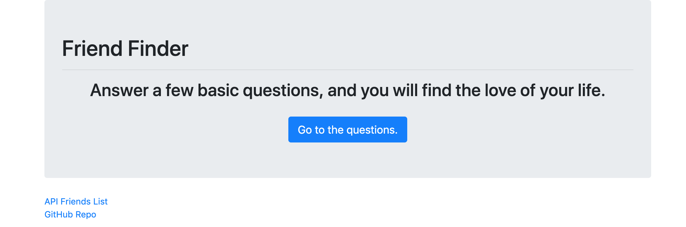

# Friend-Finder-Express :underage:

[](https://travis-ci.org/joemccann/dillinger)

## Contributors
@rcubillo

## Technology
* Express
* Js
* HTML 5
* NPM

## Overview

"FriendFinder" application is basically a dating app. This full-stack site will take in results from my users' surveys, then compare their answers with those from other users. The app will then display the name and picture of the user with the best overall match.

[](https://youtu.be/UuvgW7Ws6-M)

## How this works

I used Express to handle routing. It is deployed on Heroky. 

### Instructions

1. The survey should have 10 questions of my choosing. Each answer should be on a scale of 1 to 5 based on how much the user agrees or disagrees with a question.

2. The `server.js` file should require the basic npm packages: `express` and `path`.

3. Your `htmlRoutes.js` file should include two routes:

   * A GET Route to `/survey` which should display the survey page.
   * A default, catch-all route that leads to `home.html` which displays the home page.

4. The `apiRoutes.js` file should contain two routes:

   * A GET route with the url `/api/friends`. This will be used to display a JSON of all possible friends.
   * A POST routes `/api/friends`. This will be used to handle incoming survey results. This route will also be used to handle the compatibility logic.

5. You should save your application's data inside of `app/data/friends.js` as an array of objects. Each of these objects should roughly follow the format below.

```json
{
  "name":"Ahmed",
  "photo":"https://media.licdn.com/mpr/mpr/shrinknp_400_400/p/6/005/064/1bd/3435aa3.jpg",
  "scores":[
      5,
      1,
      4,
      4,
      5,
      1,
      2,
      5,
      4,
      1
    ]
}
```

6. This app determine the user's most compatible friend using the following as a guide:

   * It convert each user's results into a simple array of numbers (ex: `[5, 1, 4, 4, 5, 1, 2, 5, 4, 1]`).
   * With that done, it compares the difference between current user's scores against those from other users, question by question. Add up the differences to calculate the `totalDifference`.
     * Example:
       * User 1: `[5, 1, 4, 4, 5, 1, 2, 5, 4, 1]`
       * User 2: `[3, 2, 6, 4, 5, 1, 2, 5, 4, 1]`
       * Total Difference: **2 + 1 + 2 =** **_5_**

   * The closest match will be the user with the least amount of difference.

7. Once we found the current user's most compatible friend, it displays the result as a modal pop-up.
   * The modal should display both the name and picture of the closest match.
 

## Contributing Guidelines

All contributions and suggestions are welcome! For direct contributions, please fork the repository and file a pull request.

## Contact

Developer/Full-stack Web Software Developer
   
 * :email: E-mail: ronaldcubillo92@gmail.com
 * [Twitter](https://twitter.com/rcubillo92)
 * [LinkedIn](https://linkedin.com/in/ronald-cubillo/)


